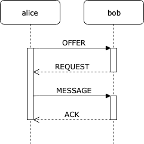

# Minimum Viable Data Synchronization

**DRAFT VERSION 0.5**

*Written by Oskar Thorén oskar@status.im & Dean Eigenmann dean@status.im*

## Table of Contents

1. [Abstract](#abstract)
2. [Definitions](#definitions)
3. [Wire Protocol](#wire-protocol)
    1. [Secure Transport](#secure-transport) 
    2. [Payloads](#payloads)
4. [Synchronization](#synchronization)
    1. [State](#state)
    2. [Flow](#flow)
    3. [Retransmission](#retransmission)
5. [Footnotes](#footnotes)

## Abstract

In this specification we describe a minimum viable protocol for data synchronization inspired by the Bramble Synchronization Protocol<sup>1</sup>. This protocol is designed to ensure reliable messaging between peers communicating across an unreliable peer-to-peer (P2P) network where they may be unreachable or unresponsive.

We present a functional specification for future implementation<sup>2</sup> as well as reference simulation data which demonstrates its performance.

## Definitions

| Term | Description |
|------|-------------|
| **Peer** | The other nodes that a node is connected to. |
| **Record** | Defines a payload element of either the type `OFFER`, `REQUEST`, `MESSAGE` or `ACK` |

## Wire Protocol

### Secure Transport

This specification does not define anything related to the transport of packets. It is assumed that this is abstracted in such a way that any secure transport protocol could be easily implemented. Likewise, properties such as confidentiality, integrity, authenticity and forward secrecy are assumped to be provided by a layer below.

### Payloads

Payloads are implemented using [protocol buffers](https://developers.google.com/protocol-buffers/).

```protobuf
message Payload {
  Ack ack = 1;
  Offer offer = 2;
  Request request = 3;
  repeated Message messages = 4;
}

message Ack {
  repeated bytes id = 1;
}

message Message {
  bytes group_id = 1;
  int64 timestamp = 2;
  bytes body = 3;
}

message Offer {
  repeated bytes id = 1;
}

message Request {
  repeated bytes id = 1;
}
```

## Synchronization

### State

State is kept for any record of the types `OFFER`, `REQUEST` and `MESSAGE` we do not keep states for `ACK` records as we do not retransmit those periodically. State is stored per peer. The following information is stored for records:

 - **Type** - Either `OFFER`, `REQUEST` or `MESSAGE`
 - **Send Count** - The amount of times a record has been sent to a peer.
 - **Send Epoch** - The next epoch at which a record can be sent to a peer.

### Flow

A maximum of one payload is sent to peers per epoch, this payload contains all `ACK`, `OFFER`, `REQUEST` and `MESSAGE` records for the specific peer. Payloads are created every epoch containing reactions to previously received records by peers or new records being sent out by nodes. 

Nodes have two modes with which they can send records, `BATCH` and `INTERACTIVE` mode. The following rules dictate how nodes construct payloads every epoch for any given peer for both modes.

#### Interactive Mode

 - A node initially offers a `MESSAGE`, this means an `OFFER` is added to the next payload and the state for the given peer.
 - When a node recieves an `OFFER`, a `REQUEST` is added to the next payload and the state for the given peer. 
 - When a node recieves a `REQUEST` for a previously sent `OFFER`, the `OFFER` is removed from the state and the corresponding `MESSAGE` is added to the next payload and the state for the given peer.
 - When a node receives a `MESSAGE`, the `REQUEST` is removed from the state and an `ACK` is added to the next payload for the given peer.
 - When a node receives an `ACK`, the `MESSAGE` is removed from the state for the given peer.
 - All records that require retransmission are added to the payload, given `Send Epoch` has been reached.

<p align="center">
    
    <br />
    Figure 1: Delivery without retransmissions in interactive mode.
</p>

#### Batch Mode

 1. When a node sends a `MESSAGE`, it is added to the next payload and the state for the given peer.
 2. When a node receives a `MESSAGE`, an `ACK` is added to the next payload for the corresponding peer.
 3. When a node receives an `ACK`, the `MESSAGE` is removed from the state for the given peer.
 4. All records that require retransmission are added to the payload, given `Send Epoch` has been reached.

<!-- diagram -->

<p align="center">
    
    <br />
    Figure 1: Delivery without retransmissions in batch mode.
</p>


<!-- Interactions with state, flow chart with retransmissions? -->

### Retransmission

The record of the type `Type` is retransmitted every time `Send Epoch` is smaller than or equal to the current epoch.

`Send Epoch` and `Send Count` are increased every time a record is retransmitted. Although no function is defined on how to increase `Send Epoch`, it should be exponentially increased until reaching an upper bound where it then goes back to a lower epoch in order to prevent a records `Send Epoch`'s from becoming too large.

> ***NOTE:** We do not retransmission `ACK`s as we do not know when they have arrived, therefore we simply resend them every time we receive a `MESSAGE`.*

## Footnotes

1. https://code.briarproject.org/briar/briar-spec/blob/master/protocols/BSP.md
2. https://github.com/status-im/mvds
