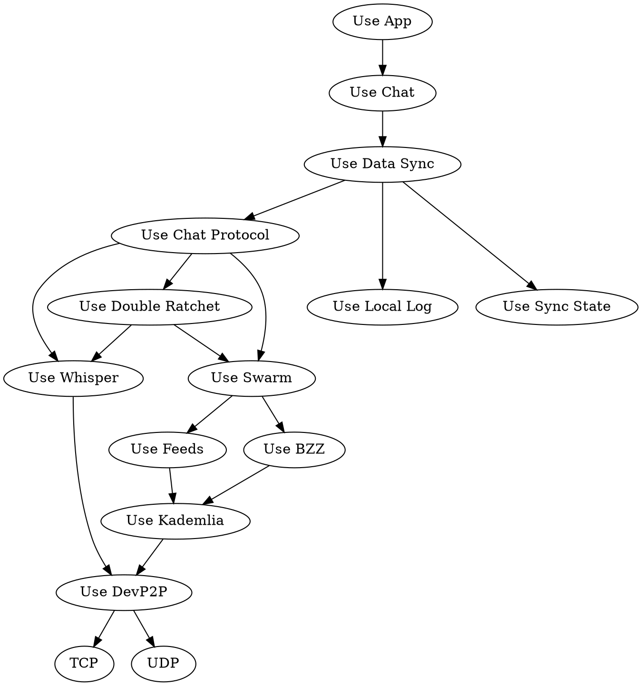
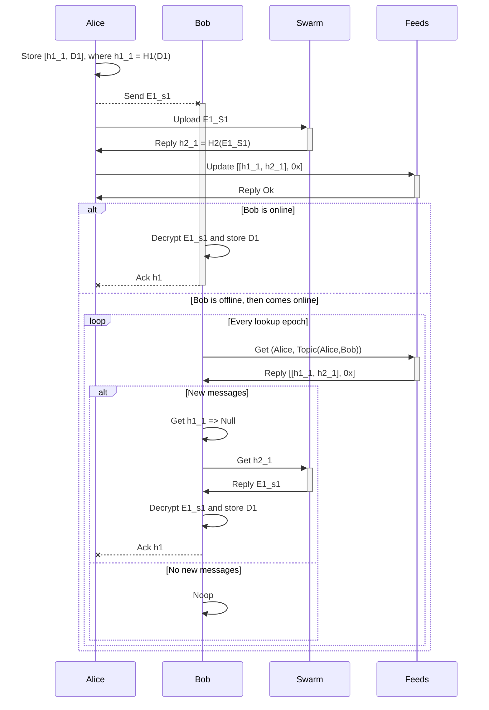

# Extending Data Sync with a remote log

MVDS doesn't currently deal with mostly-offline devices. This specification extends MVDS with a remote log, Swarm Feeds, to address this problem. This means a node can read from another node that is offline.

## Use case

Each edge here represents a "A uses B" relationship.



For a more in-detail look at the Swarm module, see this [component overview](https://swarm-guide.readthedocs.io/en/latest/architecture.html#high-level-component-description).

### Use Data Sync

Main flow of events:

```
Receive incoming message from chat app or peer.
Dispatch it to the corresponding procedure.
New message (Interactive mode):
  Store message locally.
  Add OFFER to next payload and to sync state.
  Go to SwarmFeedUpload procedure.
New message (Batch mode):
  Store message locally.
  Add MESSAGE to next payload and to sync state.
  Go to SwarmFeedUpload procedure.
Receiving OFFER:
  Add REQUEST to the next payload and to sync state.
Receiving REQUEST:
  If previously sent OFFER, remove OFFER from sync state.
  Add corresponding MESSAGE to next paylad and sync state.
Receiving MESSAGE:
  Store message locally in log.
  Remove REQUEST from state.
  Add ACK to the next payload.
  Deliver message to chat app.
Receiving ACK:
  Remove MESSAGE from state.
  Deliver message to chat app.

Every epoch:
  Add messages that have met retransmission criteria to payload.
  Send one or zero payloads to each peer through chat protocol.

SwarmFeedUpload:
  ...see sequence diagram...
  
Every lookup epoch:
  ...lookup feed...
  
```

<!--
Not captured well:
- Local messages stored where and by who?
- Initial sharing process?
- Receiving SEND?
- Receiving ACK flow a bit weird?
-->

<!--
## Collaboration diagram
Same as sequence diagram?
-->

## Sequence diagram

- Dn = data payload
- En_sn = encrypted payload, with session key sn
- H1(Dn) = message id hash
- H2(En_sn) = swarm chunk hash

<!--
- Alice: Alice's pubkey, assume one device
- Bob: Bob's pubkey, assume one device
- Feed 1: Alice's feed, F(alice_pk, topic, bob_pk)
- Feed 2: Topic assumed to be static, can be ratcheted
- Feed 3: Assumes Swarm and feeds being monotonic
- Wire 1: Assumes addressing with only pubkey
- Wire 2: Assumes Double Ratchet session exists
-->



For more messages, the feed format uses a page size to enable fetching of multiple chunk ids in one go. E.g. for page size 2 we have a list of two elements together with a pointer to later chunk pages: `[[h1_3, h2_3], [h1_2, h2_2]], next_page_chunk]`.


<!--
TODO: Specify page format better so part of sequence diagram

Page size format and pointers/seq number for data sync messages too?

NOTE: Add hints for feeds as well

-->

<!--
# Problem: If you know what the feed is, you can see message ids

# Possible solutions:
# - Ratchet topic
# - Encrypt each chunk head with existing session ratchet
-->
